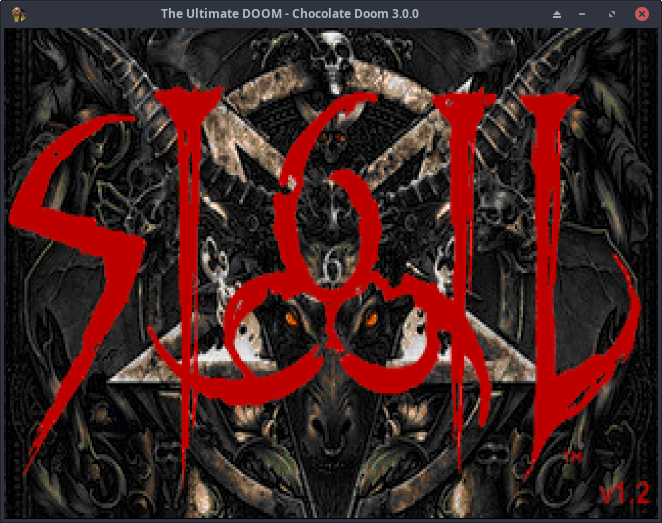

# John Romero PWADs

In the late 2010s, [John Romero](https://doomwiki.org/wiki/John_Romero), who was one of the founding members of [id Software](https://doomwiki.org/wiki/id_Software) and had a large hand in making the original Doom games, started to make new maps for the first-person shooter, some of which - [Tech Gone Bad](https://doomwiki.org/wiki/Tech_Gone_Bad) and [SIGIL](https://doomwiki.org/wiki/SIGIL) - won or were runner-ups for [Cacowards](https://doomwiki.org/wiki/Cacowards).

Sadly, all of the maps that Romero made, ignoring the ones he made while at id Software, are not vanilla and as such, '''cannot be played on Chocolate Doom''' or else the port will crash, however, a person is able to play the maps on ports like [Crispy Doom](https://www.chocolate-doom.org/wiki/index.php/Crispy_Doom), [Doom Retro](https://www.chocolate-doom.org/wiki/index.php/Doom_Retro), or even others that are [not forks of Chocolate Doom as long as it is limit-removing](https://doomwiki.org/wiki/Source_port).

Despite this, if you want to play any of the WADs via Crispy Doom, it is quite simple, simply download the WAD that you want and run a command that looks like this:

> crispy-doom -iwad doom.wad -merge example.wad

After this, you should be able to play the PWAD just fine, although keep in mind that if you play [Tech Gone Bad](https://doomwiki.org/wiki/Tech_Gone_Bad) or [Phobos Mission Control](https://doomwiki.org/wiki/Phobos_Mission_Control), you will have to skip to levels E1M8 and E1M4 respectfully by using the `idclev18` and `idclev14` cheat.

### SIGIL: Vanilla Edition
Three years after SIGIL was released, in 2022 the_kovic on Doomworld was able to make a port for the game that can be played natively on DOS and Chocolate Doom without many issues to be seen - as noted in [the Doomworld post for the announcement](https://www.doomworld.com/forum/topic/127672), this is not a one-to-one of the game, writing "In my modification process, I put emphasis on keeping the gameplay as similar to the original as possible. This meant I avoided layout changes and prioritized removing detail from non-gameplay areas".

The port for the game was made thanks to the_kovic reviewing the PWAD in [Chocorenderlimits](https://www.chocolate-doom.org/wiki/index.php/Chocorenderlimits), using the fork to see information about any parts of the map that may crash the game, they also used Chocolate Doom itself to "make sure it adheres to all the limits".

Downloading and running this version of the game, that John Romero himself gave approval to, can be found [via the forum](https://www.doomworld.com/forum/topic/127672) ([or by clicking this direct link](https://www.doomworld.com/applications/core/interface/file/attachment.php?id=170902)), extracting it, and running the following command:

> chocolate-doom -iwad doomu.wad -merge SIGILDOS.wad

The vanilla port of SIGIL is not perfect and there are some issues that should be noted:

* Multiplayer-only parts of the original maps were removed as the_kovic could not "guarantee their vanilla compatibility".
* Due to the edits made to the maps, there will be a demos desync
* The game will crash on startup if not played on the Ulterment Doom

Despite this, the port is faithful to the original version of the game.

## External links

* [DOOM Episode 5 - Sigil Running Under DOS](https://www.youtube.com/watch?v=dOJfikjIqWg) - Video about how to run the WAD via Boom on DOS
* [Add support to Sigil](https://github.com/chocolate-doom/chocolate-doom/issues/1173) - Failed request on asking SIGIL to be able to be supported on Chocolate Doom

[Category:WADs](https://www.chocolate-doom.org/wiki/index.php/Category:WADs)
